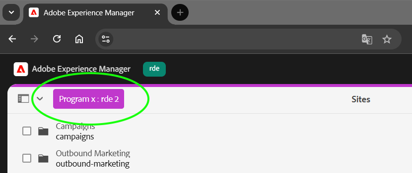
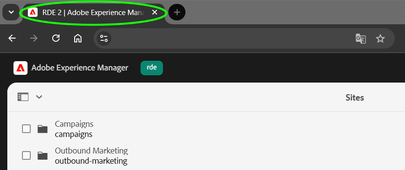

# AEM Environment Badge

<p align="center">
    <a href="https://maven-badges.sml.io/sonatype-central/com.merkle.oss.aem/aem-environment-badge/">
        </a>
    <a href="https://javadoc.io/doc/com.merkle.oss.aem/aem-environment-badge">
        </a>
    <a href="https://sonarcloud.io/summary/overall?id=merkle-open_aem-environment-badge&branch=master">
        </a>
    <a href="https://sonarcloud.io/summary/overall?id=merkle-open_aem-environment-badge&branch=master">
        </a>
    <a href="https://sonarcloud.io/summary/overall?id=merkle-open_aem-environment-badge&branch=master">
        </a>
    <a href="https://sonarcloud.io/summary/overall?id=merkle-open_aem-environment-badge&branch=master">
        </a>
    <a href="https://sonarcloud.io/summary/overall?id=merkle-open_aem-environment-badge&branch=master">
        </a>    
    <a href="https://sonarcloud.io/summary/overall?id=merkle-open_aem-environment-badge&branch=master">
        </a>
    <a href="https://github.com/merkle-open/aem-environment-badge/actions/workflows/verify-snapshot.yml">
        </a>
    <a href="https://github.com/merkle-open/aem-environment-badge/actions/workflows/deploy-snapshot.yml">
        </a>
</p>

The **Environment Badge** is a lightweight visual utility designed for the AEM Authoring UI. It provides instant
identification of the active program and environment, mitigating the risk of performing configurations or content
authoring in the wrong instance.

## Key Features

* **Visual indicators:** Renders a high-visibility badge and a context bar within the AEM Authoring UI and CRX Explorer.
* **Unified Shell compatibility:** Designed to work seamlessly with or without the AEM Unified Shell.
* **Browser tab identification:** Optionally prefixes the document title to help users manage multiple open environments
  in browser tabs.
* **Environment specific configuration:** Leverages OSGi and environment variables to allow unique identification of
  tiers.

| Feature                   | Description                                                                                                   | Preview                                          |
|:--------------------------|:--------------------------------------------------------------------------------------------------------------|:-------------------------------------------------|
| **Badge**                 | Displays a configurable title and background color. If no title is set, only the conetxt bar remains visible. |                     |
| **Document title prefix** | Prefixes the tab title: `<PREFIX> \| <DOCUMENT TITLE>`                                                        |       |
| **Color palette**         | Predefined set of colors available                                                                            |  |

## Installation

### Maven dependency

Add the `aem-environment-badge.all` artifact to the `<dependencies>` section

```xml

<dependency>
    <groupId>com.merkle.oss.aem</groupId>
    <artifactId>aem-environment-badge.all</artifactId>
    <version>1.0.0</version>
    <type>zip</type>
</dependency>

```

### Package embedding

Embed the package into your `all` deployment module using the `filevault-package-maven-plugin`:

```xml

<embedded>
    <groupId>com.merkle.oss.aem</groupId>
    <artifactId>aem-environment-badge.all</artifactId>
    <target>/apps/{your/install/path}/install</target>
</embedded>

```

### Configuration

Define an OSGi configuration scoped to your desired AEM environment using the following PID:
`com.merkle.oss.aem.environmentbadge.services.impl.AEMEnvironmentBadgeConfigServiceImpl.cfg.json`

**Pro-Tip:** Leverage environment variables to allow different environments within the same tier to have unique
identities,
exceeding the capabilities of the
OOTB [Unified Shell indicator](https://experienceleague.adobe.com/en/docs/experience-manager-cloud-service/content/overview/aem-cloud-service-on-unified-shell#identify-aemaacs-environment).

#### Example configuration (rde tier)

```json
{
  "enableDocumentTitlePrefix": true,
  "documentTitlePrefix": "$[env:ENV_BADGE_DOC_TITLE_PREFIX;default=RDE]",
  "enableBadge": true,
  "badgeTitle": "$[env:ENV_BADGE_TITLE;default=rde]",
  "badgeBackgroundColor": "fuchsia"
}
```

#### Properties reference

| Property                     | Description                                                                                                                             | Default   |
|------------------------------|-----------------------------------------------------------------------------------------------------------------------------------------|-----------|
| Enable document title prefix | Toggles the feature to prepend a prefix to the document title (browser tab)                                                             | `false`   |
| Document title prefix        | The string prefix to be prepended to the browser tab title.<br/>*E.g.*: `<PREFIX> \| <DOCUMENT TITLE>`                                  | -         |
| Enable environment badge     | Toggles the feature of a visual badge and bar component to be rendered in the AEM Author UI                                             | `false`   |
| Badge title                  | The text content displayed on the environment badge                                                                                     | -         |
| Background color             | The color string defining the badge's background color.<br/>*Options*:`red`,`blue`,`green`,`orange`,`grey`,`yellow`,`seafoam`,`fuchsia` | `fuchsia` |

## Development

Build the full package

```
    mvn clean install -PautoInstallBundle
```

Build and deploy the full package to a local AEM Author:

```
    mvn clean install -PautoInstallPackage
```

## Compatibility & Requirements

### AEM Version

This tool requires **AEM Version 2025.9.x** or higher.

### Platform Support

- **AEM as a Cloud Service (AEMaaCS):** This tool is primarily designed and optimized for Cloud Service environments.
- **AEM On-Premise / Adobe Managed Services:** While the codebase is compatible with standard AEM On-Premise
  installations, please note that it has not been formally tested in these environments.

---

### Credits

[//]: # (@formatter:off)

> [!NOTE]
> This project is inspired by the [AEM Environment Indicator](https://adobe-consulting-services.github.io/acs-aem-commons/features/environment-indicator/index.html), a feature of the [ACS AEM Commons](https://adobe-consulting-services.github.io/acs-aem-commons/) library.

[//]: # (@formatter:on)
